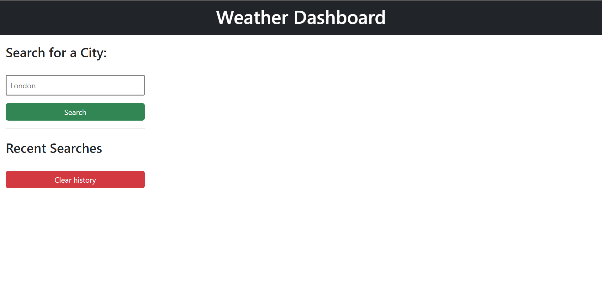
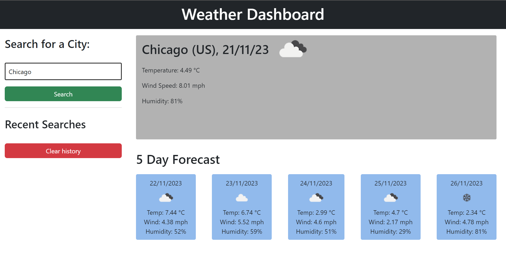
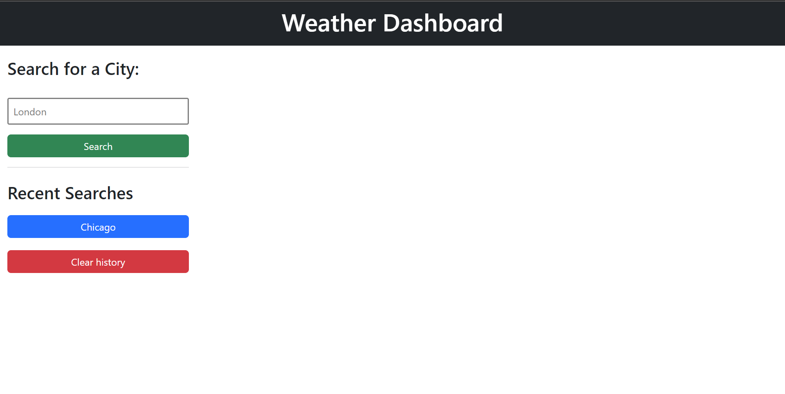

# Weather Dashboard Project

## Contents

- [About The project](#about-the-project)
- [How do I use the program?](#how-do-i-use-the-program)
- [Dependencies](#Dependencies)
- [How do I access the page?](#how-do-i-access-the-page)

## About The Project

The weather dashboard allows the user to search for a city and see the current weather as well as a five day forecast.

The forecast data shows the temperature on each day at roughly the same time as the time the search is made

---

## How do I use the program?

Initially the webpage looks like this: 

\
You can type the name of any city into the input with the placeholder text 'London'

Once you click search (or press enter), you'll be presented with something that looks like this: 

\

Once you refresh teh webpage, you'll see the your search history appear like so: 

\

\
A quick note: Some city names appear in more than one country e.g. Birmingham. The option that is defaulted to is somewhat unpredictable so be sure to include the country name. So for Birmingham in the UK the search would be 'Birmingham, UK'

---

## Dependencies

This project uses the Day.js and OpenWeathermap APIs

---

## How do I access the page?

The webpage has been deployed via Github pages. [Click here](https://syntaxerror-23.github.io/weather-dashboard-project/) to access it.
